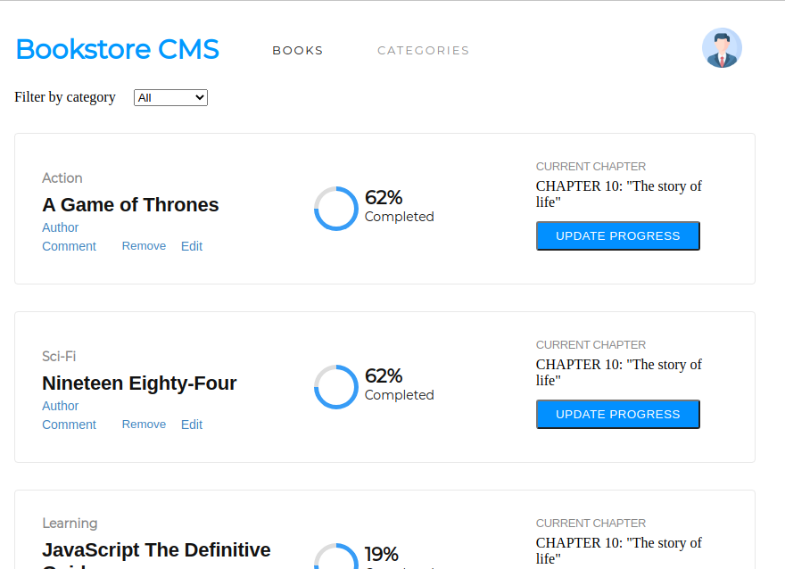

# Bookstore CMS - React-Redux App



##### In this milestone, I completed the following tasks:

- Implement the design UI provided by the Zeplin project.

- Deploy the app on Heroku.


## 📝 Setup

 - Open a terminal
 
 - Clone this app: 
        ```
        git clone https://github.com/ezeilo-su/bookstore.git
        ```

- ```cd``` into the app directory.

- Run the command ```npm install``` to install the app dependencies.

- In the project directory, run:

#### `npm start`

Runs the app in the development mode.\
Open [http://localhost:3000](http://localhost:3000) to view it in the browser.

The page will reload if you make edits.\
You will also see any lint errors in the console.


### Check out live demo [here](https://reactredux-bookstore.herokuapp.com/)


## Author

👤 **Sunday Uche Ezeilo**

- Github: [@sundayezeilo](https://github.com/ezeilo-su)
- Twitter: [@SundayEzeilo](https://twitter.com/SundayEzeilo)
- Linkedin: [Sunday Ezeilo](https://www.linkedin.com/in/sundayezeilo/)


## 🤝 Contributing

- Contributions, issues, and feature requests are welcome!

- Feel free to check the [issues page](https://github.com/ezeilo-su/bookstore/issues).

## Show your support

Give a ⭐️ if you like this project!


## Acknowledgments

- Microverse
- etc

## Credit
- Design UI by [Zeplin project](https://app.zeplin.io/project/5b35a9e13227086040f8eb75/screen/5b695e29bb8c844f118f9378).

## 📝 License

This project is MIT-licensed.